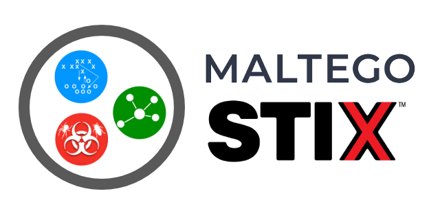

# Maltego STIX2 entities

This project allows you to generate a set of Maltego entities generated from official STIX 2 schemas.
It also contains generic transforms to explore the properties of STIX 2 entities.
The set of entities with the default configuration provided here is also distributed in the official [Maltego Transform Hub](https://www.maltego.com/transform-hub/).

## Dependencies in submodules

We are using the following assets to generate STIX2 Maltego entities:

- Official STIX 2 schemas : https://github.com/oasis-open/cti-stix2-json-schemas
- Icons : https://github.com/freetaxii/stix2-graphics (Copyright 2016-2019 Bret Jordan, All rights reserved.)

## Usage

If you are only using the default Maltego entities and don't want to customize anything, you can install the entities distributed in the official [Maltego Transform Hub](https://www.maltego.com/transform-hub/).

If you want to customize these entities (heritage with other entities, default transform to explore STIX2 properties), you can use this project to generate your own set of entities.

If you want to build your own transforms using these entities, you can install the maltego_stix2 python package to help you write them. It contains the definition of the entities to be able to return them in your transforms, as well as utility functions to translate a Maltego entity into and from a STIX2 object. A template for such a transform is provided in [./trx-demo](./trx-demo).

## Configuration

 - To customize the STIX2 schemas used for the generation of entities, see [./maltego_stix2/config.py](./maltego_stix2/config.py), the submodule [./cti-stix2-json-schemas](./cti-stix2-json-schemas) and the manual [./cti-stix2-json-schemas-extended](./cti-stix2-json-schemas-extended) currently set-up for OpenCTI compatibility
 - To customize the icons used for Maltego-STIX2 entities, see [/maltego_stix2/config.py](./maltego_stix2/config.py), the submodule [./stix2-graphics](./stix2-graphics) and the manual [./stix2-graphics-extended](./stix2-graphics-extended)
 - To customize heritage between Maltego-STIX2 entities and other Maltego entities, see the mapping in [./maltego_stix2/config.py](./maltego_stix2/config.py)
 - To use local transforms which handle the exploration of STIX2 properties, see [./local_config.py](./local_config.py) and [./transforms.csv](./transforms.csv)
 - To use an iTDS, make sure to configure its URL in [./local_config.py](./local_config.py)
 - To generate custom entities, properties and transforms for the OpenCTI-STIX2 compatibility, add the argument *--with-opencti* on all bash scripts

## Generation

```
$ git clone https://github.com/amr-cossi/maltego-stix2
$ cd maltego-stix2
$ git submodule init
```

### Requirements

Please install the following requirements before generating the Maltego-STIX2 entities:

- Python >= 3.6
- Libraries in ./requirements.txt

```
$ pip3 install -r requirements.txt
```

For any customization of the heritage configuration of the entities, a custom version of the maltego-stix2 package has to be installed:

```
$ pip3 install .
```

### Generate

To generate the `entities.mtz` file:

```
$ git submodule update --remote
$ ./build_entities.sh (--with-opencti)
```

To generate the `transforms.mtz` file (the transforms require installing this library in your environment):

```
$ python3 setup.py install
$ ./build_transforms.sh (--with-opencti)
```

To run the transforms locally, make sure the path to TRX `project.py` is set up in [./local_config.py](./local_config.py)

For any customization of the types of the entities, a custom version of the maltego-stix2 package has to be re-installed:

```
$ pip3 install .
```

### Import

Import the files `output/entities.mtz` and `output/transforms.mtz` in Maltego using the "Import config" menu.

If you use an iTDS, import the file `output/importable_itds_config.csv` in your iTDS management platform.

## Contributing

### Code of Conduct

We follow a standard [Code of Conduct](CODE_OF_CONDUCT.md) that we expect project participants to adhere to. Please read the [full text](CODE_OF_CONDUCT.md) so that you can understand what actions will and will not be tolerated.

### How to contribute

This module is not a huge project with an intense roadmap. Feel free to contribute through issues linked to pull requests for new features and bug solving.

### TODO: known wanted enhancements

- Rely on external library to parse JSON-ref files
- Add missing icons for some observables